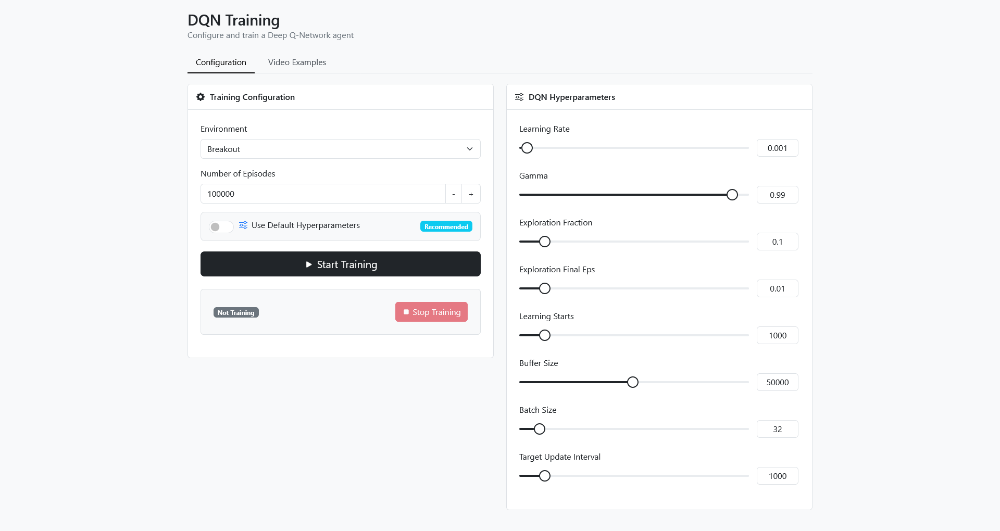

# Reinforcement Learning - DQN Agent

Training and testing scripts for DQN agents in different game environments.
Includes a web-based platform for tuning the hyperparameters and training the DQN agents on various reinforcement learning environments.




## Features

- 🎮 Train the DQN agents on multiple environments:
  - Atari games: Breakout, Pacman, DonkeyKong
  - Regular environments: CartPole, LunarLander, MountainCar
- ⚙️ Customize hyperparameters or use optimized defaults
- 📊 Real-time training status monitoring
- 🎥 Watch pre-trained agents performace
- 🐳 Docker support for easy deployment

## Installation

Choose one of the following installation methods:

### Option 1: Local Installation

**Prerequisites:**
- Python 3.9+
- CUDA-compatible GPU (recommended)

Steps:
1. Clone the repository:
   ```bash
   git clone https://github.com/Yuval1Gutman/FinalProject
   cd FinalProject
   ```

2. Create and activate a virtual environment:
   ```bash
   python -m venv .venv
   # On Windows:
   .venv\Scripts\activate
   # On Linux/Mac:
   # source .venv/bin/activate
   ```

3. Install dependencies:
   ```bash
   pip install -r requirements.txt
   ```

### Option 2: Docker Installation

**Prerequisites:**
- [Docker](https://www.docker.com/get-started)
- CUDA-compatible GPU (recommended)

Steps:
1. Clone the repository:
   ```bash
   git clone https://github.com/Yuval1Gutman/FinalProject
   cd FinalProject
   ```

2. Build and run the Docker container:
   ```bash
   docker build -t dqn-training .
   docker run -it -p 5000:5000 --gpus all dqn-training
   ```

## Usage

### Web Interface

1. Start the web server:
   ```bash
   flask run
   ```

2. Open your browser and navigate to:
   ```
   http://localhost:5000
   ```

### Manual Training

You can also train agents directly from the command line:
```bash
python src/train_agent.py <environment>
```

Example:
```bash
python src/train_agent.py breakout
```

Available environments are defined in `src/config.py`. Training hyperparameters can be customized by modifying the training script.

## Training Interface

The web interface allows you to:

1. Select an environment (Breakout, Pacman, DonkeyKong, CartPole, LunarLander, MountainCar)
2. Use default hyperparameters or customize:
   - Learning rate
   - Discount factor (gamma)
   - Exploration parameters
   - Buffer size
   - Batch size
   - Update intervals
3. Start and stop training with real-time status updates


## Examples

### Breakout
https://github.com/user-attachments/assets/48f52e7b-14a2-44eb-a846-d5030255e896

### Pacman
https://github.com/user-attachments/assets/a677759c-7c89-4d44-9cfc-4e70ef331f61

### Tetris
https://github.com/user-attachments/assets/13b8763c-db99-40c1-95a4-a47bdc1c3574


## Project Structure


```
FinalProject/
├── Models/                    # Saved models and training logs
│   ├── breakout/
│   ├── pacman/
│   ├── teris/
│   └── graphs/                # Graphs of all 3 games to load together
├── src/
│   ├── static/
│   │   ├── css/
│   │   ├── js/
│   │   └── videos/            # Recorded agent performances
│   ├── templates/
│   ├── train_agent.py         # Training implementation
│   ├── test_agent.py          # Testing script
│   ├── record_agent.py        # Recording script
│   ├── app.py                 # Flask web application
│   └── config.py
├── .flaskenv                  # Flask environment variables
├── requirements.txt
├── Dockerfile
├── .dockerignore
├── .gitignore
└── README.md
```
